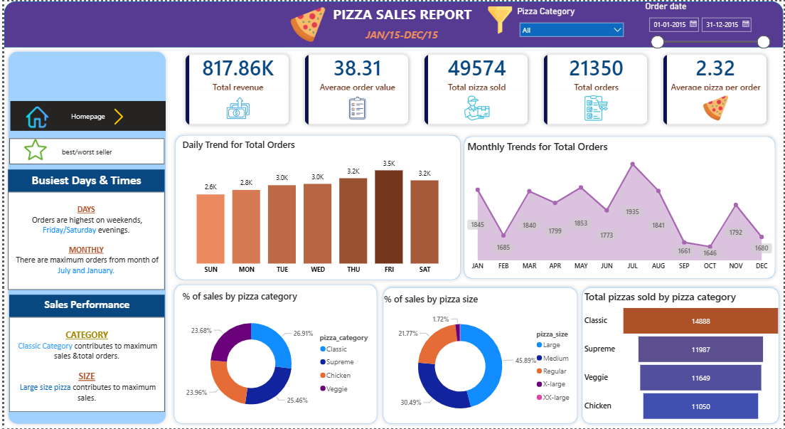
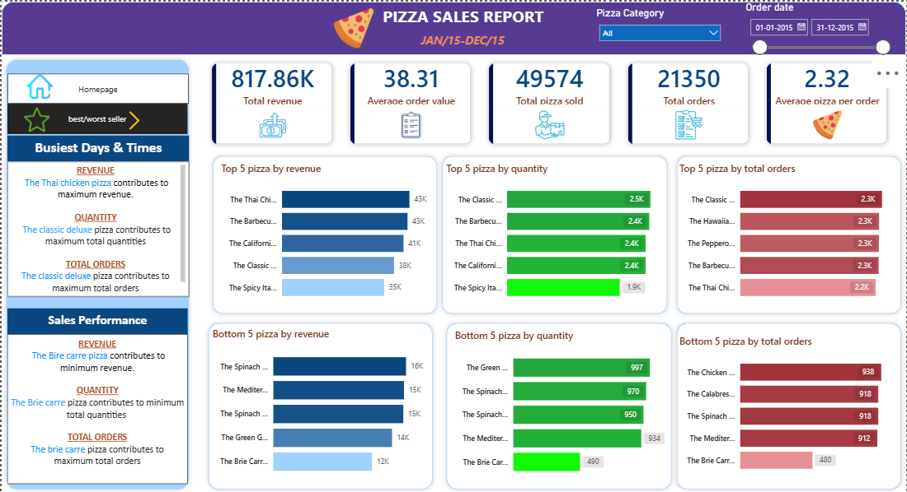

# 🍕 Pizza Sales Analysis – SQL & Power BI Project

## 📌 Overview

Pizza Sales Analysis is a business intelligence project focused on analyzing sales performance, order trends, and product performance using SQL and Power BI.

The project demonstrates strong SQL querying skills, KPI calculation, trend analysis, and dashboard development for business decision-making.

---

## 📁 Dataset

- Pizza sales transactional dataset  
- Contains order details, pizza category, size, quantity, date, and revenue  
- Stored and analyzed using MySQL  

---

## 🛠 Tools & Technologies Used

- **MySQL** – Data analysis and KPI calculation  
- **MySQL Workbench** – Query execution  
- **Power BI** – Interactive dashboard and visualization  

---

## 🔄 Project Workflow

### 1️⃣ Data Preparation

- Imported dataset into MySQL database (`pizza_sales` table)  
- Verified data types and structure  
- Created derived date column for trend analysis  

### 2️⃣ KPI Calculations (SQL)

Calculated key business metrics:

- Total Revenue  
- Average Order Value  
- Total Orders  
- Total Pizzas Sold  
- Average Pizzas per Order  

### 3️⃣ Trend Analysis

- Daily trend for total orders  
- Monthly trend for total orders  

### 4️⃣ Sales Performance Analysis

- % of Sales by Pizza Category  
- % of Sales by Pizza Size  
- Total Pizzas Sold by Category  
- Top 5 & Bottom 5 Pizzas by:
  - Revenue  
  - Quantity  
  - Total Orders  

### 5️⃣ Dashboard Development (Power BI)

- Connected MySQL to Power BI  
- Created KPI Cards  
- Designed trend charts (Daily & Monthly)  
- Built category and size distribution visuals  
- Added Top/Bottom product performance charts  
- Implemented slicers for interactive filtering  

---

## 📈 Dashboard

  

  

---

## 📊 Key Insights

- Identified highest revenue-generating pizza categories  
- Analyzed sales contribution by pizza size  
- Detected peak order days and months  
- Identified top and underperforming pizza products  
- Built a dashboard suitable for business stakeholders  

---

## ▶️ How to Run the Project

### 1️⃣ Clone the repository

git clone https://github.com/anushka-2004/pizza_sales_dashboard.git

### 2️⃣ Import Dataset into MySQL

- Create database `pizza`  
- Import dataset into `pizza_sales` table  

### 3️⃣ Execute SQL Queries

- Run KPI queries  
- Perform trend analysis  
- Generate product performance metrics  

### 4️⃣ Open Power BI

- Connect to MySQL  
- Load `pizza_sales` table  
- Explore the dashboard  

---

## 📌 Key Takeaway

This project highlights strong SQL aggregation skills, business KPI calculation, sales trend analysis, and the ability to convert raw transactional data into actionable insights using Power BI.
